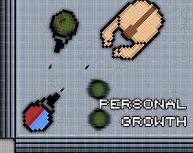

## About Me
### Hi!
I'm Sarah, a game developer studying at Humber Polytechnic's Game Programming program. I mainly work in Godot for personal projects (which will become apparent soon enough) but I also work in C++ for stuff in school! I also have been dabbling in other mediums such as music, 3D modelling, and 2D art! 

My goal is to have the skillset required to fully make a completed video game completely solo.
## Personal Projects
### Personal Growth (2024)

Personal Growth is a game I made for the 2024 GMTK Game Jam using Godot. It was my first ever published game (and even my first full project).

It was my first time participating in any sort of large scale game development and taught me how much I enjoyed it.

[**Check it out on itch.io here!**](https://flix-tdsg.itch.io/personal-growth)
### Screenboard (2025)
Screenboard is a bit unique as it's not a game exactly. It's a software (also built in Godot) that plays videos directly to your screen whilst also not intruding on the other functions of your computer.

I made it purely because I thought it would be really funny to prank my friends with it while I was screen sharing with them on Discord but I thought "Hey I'm probably not the only one who would find this entertaining." So I ended up publishing it.

[**Check out the Github Repo here!**](https://github.com/Flixcreature/Screenboard)
### Untitled Camera Game (2026 - Present)

*Concept Video*

Untitled Camera Game (or Camera Game as I'll be calling it until I make a better name) is an upcoming puzzle / survival horror game inspired by genre classics created entirely by myself (for now) in Godot.

Right now the full game is in planning stages but I intend to have at the very least a demo ready by this time next year! (October 2027)
